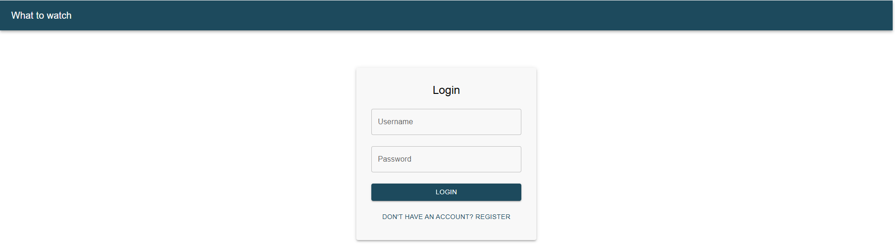
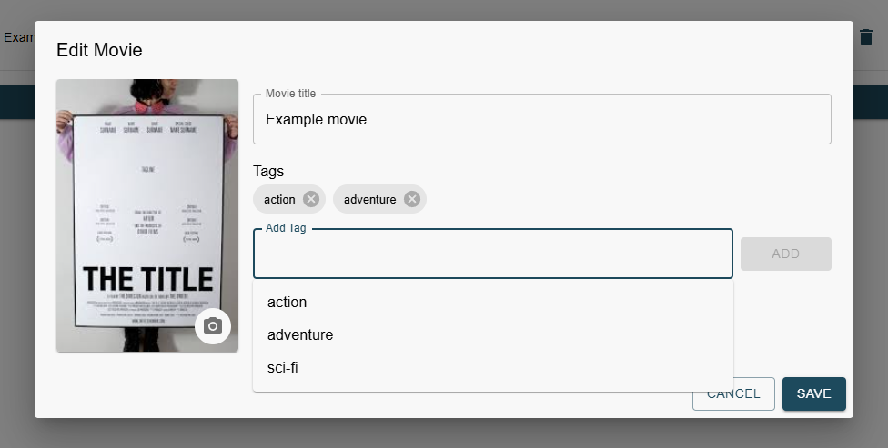
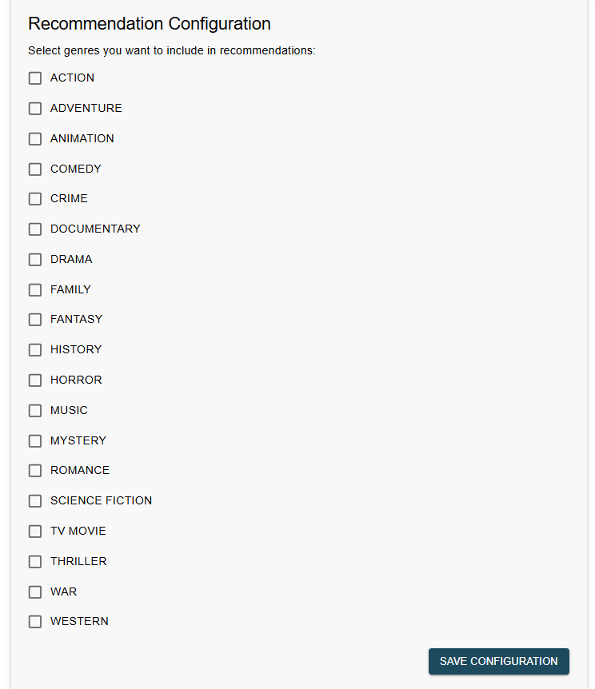

Frontend part of the "What to watch" app: https://github.com/DominikSzczesniak/what-to-watch

## Features

- **Manage Watchlist** – Add, remove, and organize movies.
- **Mark as Watched** – Track your viewing progress.
- **Smart Recommendations** – Receive suggestions based on your preferences configuration.
- **Tag Support** – Add and manage custom tags for your movies.
- **Filter & Search** – Quickly find movies by title or tags.
- **Accessible UI** – Built using Material UI
- **Scalable Architecture** – Clean, modular, and maintainable codebase.

## 🛠️ Tech Stack

- **Frontend Framework**: React
- **Language**: TypeScript
- **UI Library**: Material UI

